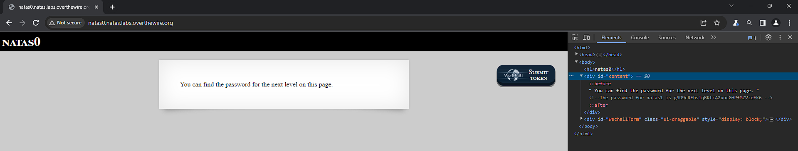

# Natas 0

Link: http://natas0.natas.labs.overthewire.org/

Here the solution is quite easy. By viewing the source code or inspecting element, we can see the password commented out.

Password: g9D9cREhslqBKtcA2uocGHPfMZVzeFK6
