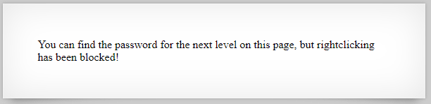
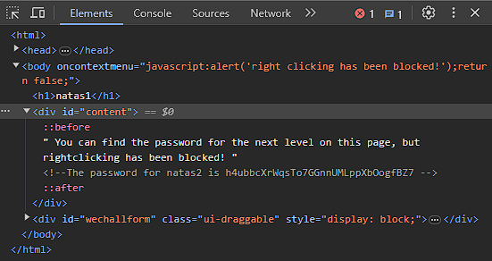

# Natas 1

Link: http://natas1.natas.labs.overthewire.org/

When we open the page we see a prompt that states that right click has been disabled, which prevents us from accessing the source code or inspecting element easily.

However there are alternatives to this. CTRL + Shift + C allows us to inspect element whereas CTRL + U allows us to view the source code. Alternatively, keeping the source code tab opened from a previous page before navigating to the natas1 page works as well.

Once again the password has been commented out.

Password: h4ubbcXrWqsTo7GGnnUMLppXbOogfBZ7
