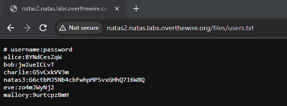

# Natas 2

Link: http://natas2.natas.labs.overthewire.org/

Opening the page doesn't give us much information. Next we check the source code to see if there's anything we can learn.

In the source code we see an image. Navigating to the image's link we are shown a small 1x1 pixel. Notice that the image is stored in the /files directory. By navigating to the url http://natas2.natas.labs.overthewire.org/files/, we can see that the files directory also contains a user.txt file.

By navigating to it we can obtain the password.

Password: G6ctbMJ5Nb4cbFwhpMPSvxGHhQ7I6W8Q