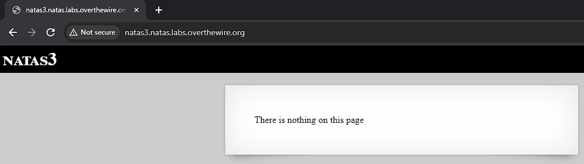
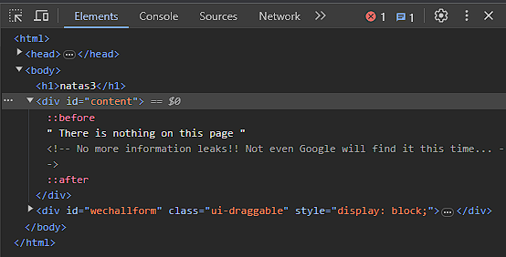
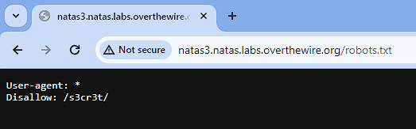
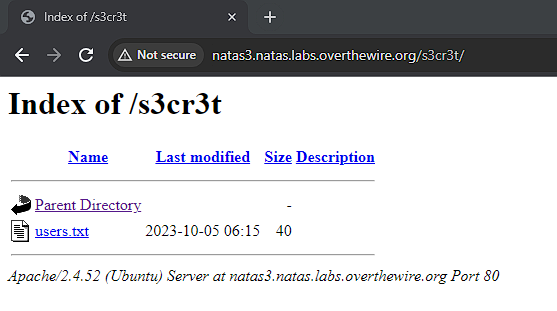
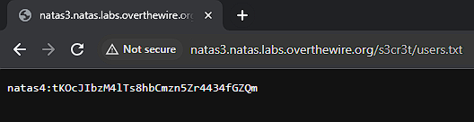

# Natas 3

Link: http://natas3.natas.labs.overthewire.org/

Opening the page doesn't give us much information. Next we check the source code to see if there's anything we can learn.

No image this time but there is a comment. "Not even Google will find it this time...". Some research directed me to learn about robots.txt.

A robots.txt is the filename used for implementing the Robots Exclusion Protocol, a standard used by websites to indicate to visiting web crawlers and other web robots which portions of the website they are allowed to visit. It is mainly used to avoid overloading a website with requests, however they can still be visited if linked from other websites.

For more reading visit: https://developers.google.com/search/docs/crawling-indexing/robots/intro#:~:text=A%20robots.txt%20file%20tells,web%20page%20out%20of%20Google.

By navigating to http://natas3.natas.labs.overthewire.org/robots.txt we see that /s3cr3t is being excluded.

By navigating to http://natas3.natas.labs.overthewire.org/s3cr3t/ we see a users.txt file.

By navigating to it we can obtain the password.

Password: tKOcJIbzM4lTs8hbCmzn5Zr4434fGZQm