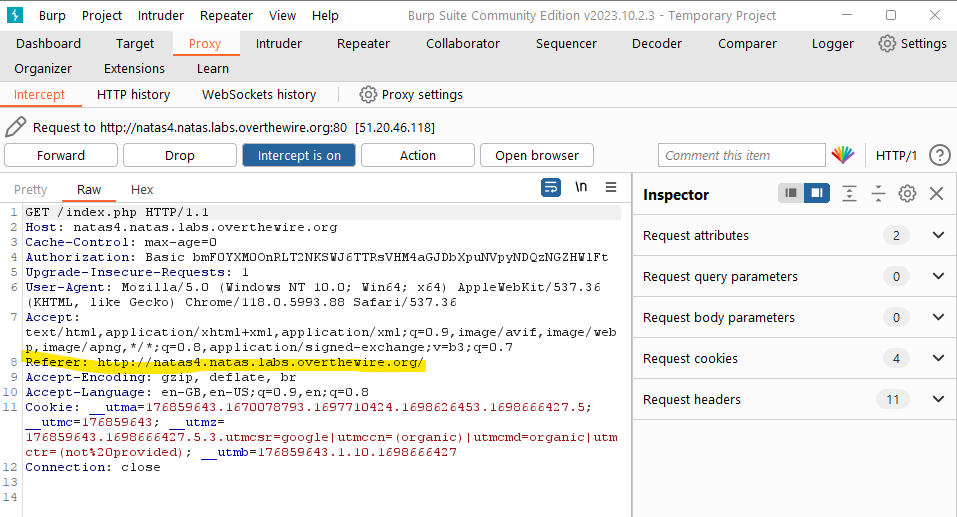

# Natas 4

Link: http://natas4.natas.labs.overthewire.org/

Opening the page we see that the page cares about where we are visiting from.

Upon refreshing the page we see that the page updates itself accordingly thus we need to find a trick the page into thinking that we are coming from natas5.

Doing some research, I was introduced to BurpSuite which is a software security application used for penetration testing of web applications. I decided to download it and learn how to use it in case I needed to use it for the future.

The free version can be downloaded here: https://portswigger.net/burp/communitydownload.

By using the Intercept feature we can change the Referer to natas5.

After doing so and forwarding the request, we are greeted with the password.

Password: Z0NsrtIkJoKALBCLi5eqFfcRN82Au2oD