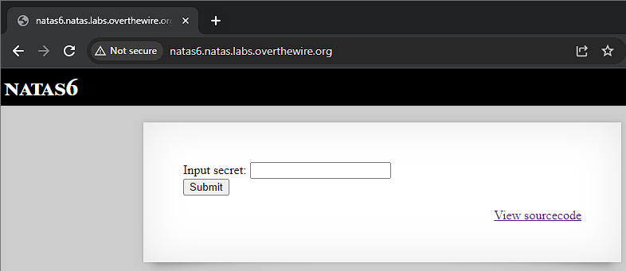
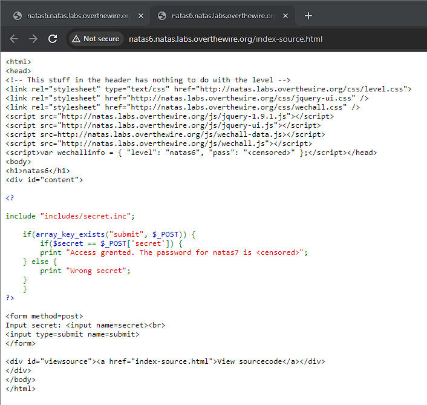
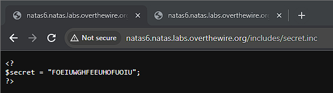
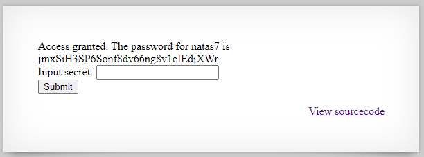

# Natas 6

Link: http://natas6.natas.labs.overthewire.org/

Opening the page we see that we have a secret that we need to input as well as a link to view the source code.

Upon viewing the source code, we see that page takes a POST request and then checks to see if the value in the input is the same as a secret value. If we have the secret, then we will get the password. We also see that "includes/secret.inc" is being included by the code. By navigating to it we obtain the secret.

After entering the secret into the input, we obtain the password.

Password: jmxSiH3SP6Sonf8dv66ng8v1cIEdjXWr