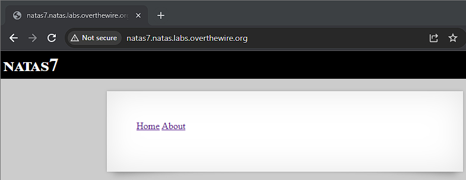
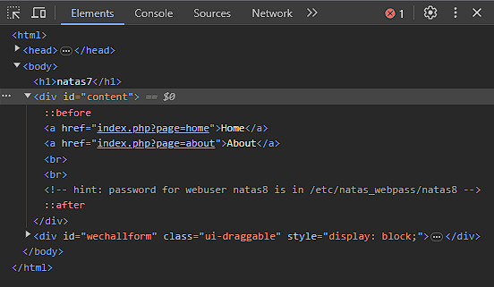
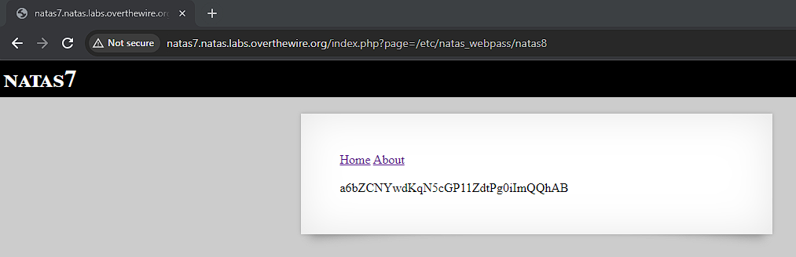

# Natas 7

Link: http://natas7.natas.labs.overthewire.org/

Viewing the page, we see that it contains links to a Home page and an About page. Clicking on either links takes us to their respective pages. We notice that the url loads using the page parameter in the url.

At this point I decided to view the source code, which contained a comment that stated password is in /etc/natas_webpass/natas8.

This could be hinting at a local file inclusion vulnerability which is an attack used to trick a web application into running files on a web server. It can occur when a web page has a file as user input without proper validation.

Next I tried to see if I can get some data using /etc/natas_webpass/natas8 as ?page parameter http://natas7.natas.labs.overthewire.org/index.php?page=/etc/natas_webpass/natas8

Sure enough I was able to obtain the password this way.

Password: a6bZCNYwdKqN5cGP11ZdtPg0iImQQhAB