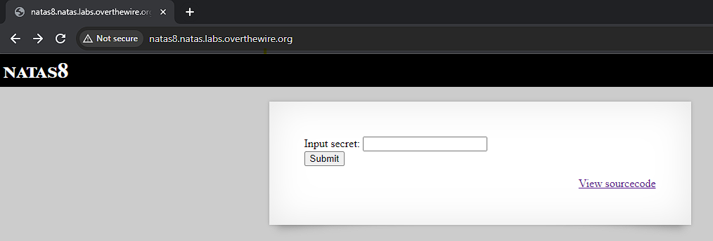
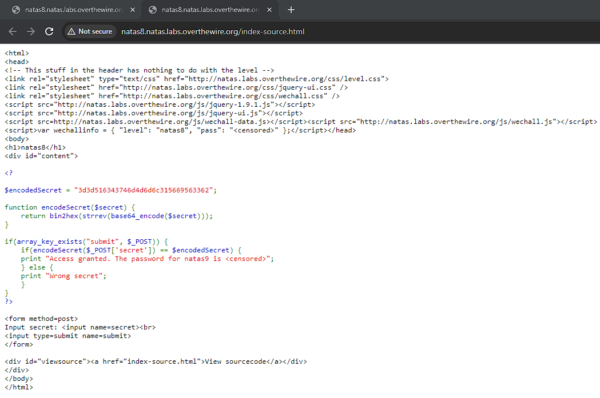
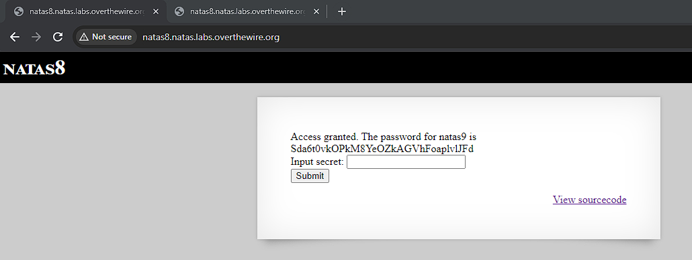

# Natas 8

Link: http://natas8.natas.labs.overthewire.org/

Viewing the page, we see once again that it is asking for a secret and a link to view the source code.

Upon viewing the source code we see that it contains the function `encodeSecret()`, which takes in a value and encodes it using `base64_encode`, `strerev` and `bin2hex` in that order.

The page takes the value provided by the input and compares it with the $encodedSecret constant. If they are the same the we can obtain the password.

I wrote up a php script in natas08.php that reverses the `encodeSecret()` function. Using the function to decoded $encodedSecret I was able to obtain the secret: oubWYf2kBq. AFter entering this into the web page I was able to obtain the password.

Password: Sda6t0vkOPkM8YeOZkAGVhFoaplvlJFd