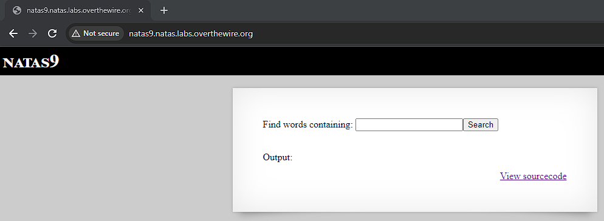
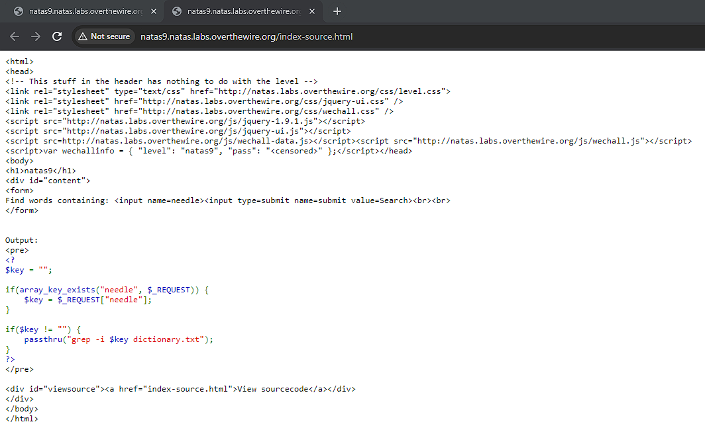
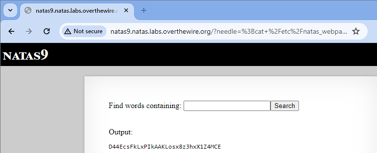

# Natas 9

Link: http://natas9.natas.labs.overthewire.org/

Viewing the page, we see that it is acting like a dictionary where we enter characters and the page will return words that contain those characters.

Viewing the source code, we see that grep is directly used with $key. This can be exploited for a command injection.

Command injections are a cyber attack in which attackers inject commands on a hosts's operating system. In our case, we are injecting a bash command. Recalling that passwords are stored in /etc/natas_webpass/* we insert the following command into the search bar: ";cat /etc/natas_webpass/natas10".

By injecting this command, we trick the web page into running "grep -i" and the semi-colon breaks up the command early and then we run "cat /etc/natas_webpass/natas10 dictionary.txt" which prints contents of files /etc/natas_webpass/natas10 and dictionary.txt.

Sure enough we obtain the password.

Password: D44EcsFkLxPIkAAKLosx8z3hxX1Z4MCE