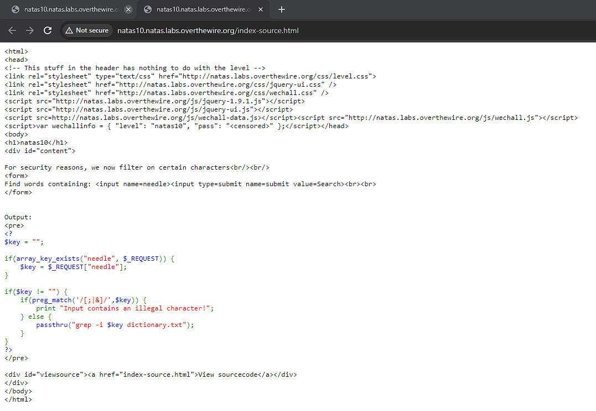

# Natas 10

Viewing the page, we see that it is similar to the previous exercise, however this time it states that it is "filtering on certain characters".

Viewing the source code, we see that ';' and '|' are excluded. This eliminates the natas9 solution, where we can break up the grep command.

However '.' and '\*' are still allowed which are the regex characters for matching anything and repetition respectively. By combining the two '.\*', the grep command will search for anything in the files.

By injecting ".\* /etc/natas_webpass/natas11" command, we trick the web page into running "grep -i .\* /etc/natas_webpass/natas11 dictionary.txt" which searches both files for lines that matches the regex. Since it will match everything, the entire contents of both files will be printed.

Sure enough we obtain the password.

Password: 1KFqoJXi6hRaPluAmk8ESDW4fSysRoIg