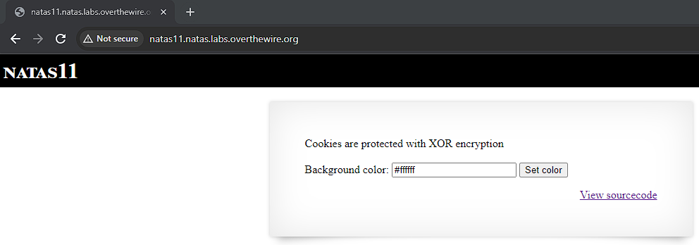
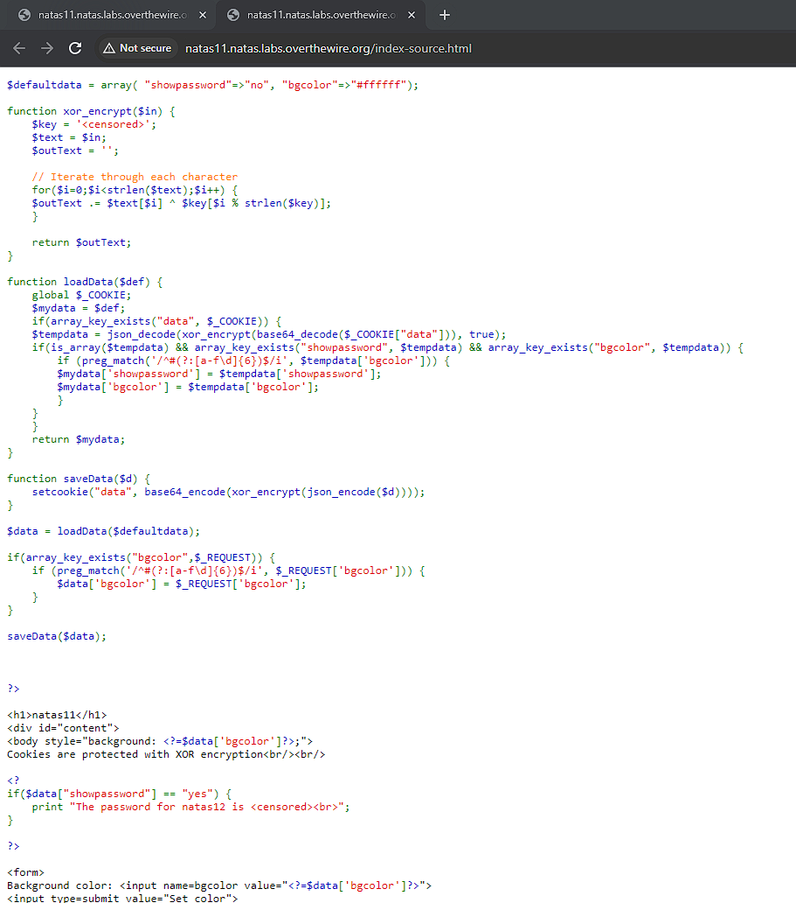
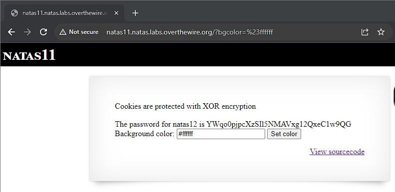

# Natas 11

Viewing the page we see that there is a search bar where we can change the colour of the background as well as a handy hint that cookies are protected with XOR encryption.

Viewing the source code, we need to set the $data object with key "showpassword" to yes in order to obtain the password. We can see that the $data object has two keys "showpassword" and "bgcolor". The $data "showpassword" value, which is normally set in cookies is XOR encrypted. Thus meaning we cannot change "showpassword":"no" to "showpassword:yes" via cookies now.

The first line of code sets $defaultValue as an array with key-value pairs"showpassword":"no" and "bgcolor":"#ffffff".

Next we call loadData(), takes $defaultdata and copies it to a local variable $mydata. It then checks for the existence of a cookie called data. If so, data is base64 decoded, xor_encrypted and then json decoded and saved in $tempdata. If $tempdata is an array that has keys "showpassword" and "bgcolor", the values replace the ones in $mydata. loadData() then returns $mydata and saves it in $data.

$data is then put through saveData(). Which sets the new cookie data to be $data after it has been json encoded, xor_encrypted and base64_encoded.

If we check the cookie, either via BurpSuite or in browser we see that it is MGw7JCQ5OC04PT8jOSpqdmkgJ25nbCorKCEkIzlscm5oKC4qLSgubjY%3D. Which is indeed a string in base64.

Looking at the xor_encrypt() function, we see that its $key is censored. It takes in a parameter and copies it to $text. Afterwards, going through each character of cookie data and XOR with characters of $key.

Thus we have to first find the key of the XOR cipher. Luckily for us, some quick [research](https://en.wikipedia.org/wiki/XOR_cipher#Use_and_security) shows that all we need to do is to apply the cipher on the plaintext using its ciphertext as the key as XOR ciphers are vulnerable to known-plaintext attacks.

Since we already know that the plaintext array('showpassword' => 'no', 'bgcolor' => '#ffffff'); will convert to the cookie MGw7JCQ5OC04PT8jOSpqdmkgJ25nbCorKCEkIzlscm5oKC4qLSgubjY%3D, we can write a php script that finds the key for us and then use that key to find the correct cookie.

Since XOR encrypting and XOR decrypting are the same operation, we can even use their xor_encrypt code to help with our decrypting. The script can be seen in natas11.php. Sure enough we find that the key is a repetition of KNHL.

Since we want to find the value where "showpasswod" is yes, we next xor_encrypt array('showpassword' => 'yes', 'bgcolor' => '#ffffff'); using key KNHL, which gives us the cookie MGw7JCQ5OC04PT8jOSpqdmk3LT9pYmouLC0nICQ8anZpbS4qLSguKmkx.

Changing the cookie and then refreshing/clicking on Set Color button gives us the password.

Password: YWqo0pjpcXzSIl5NMAVxg12QxeC1w9QG