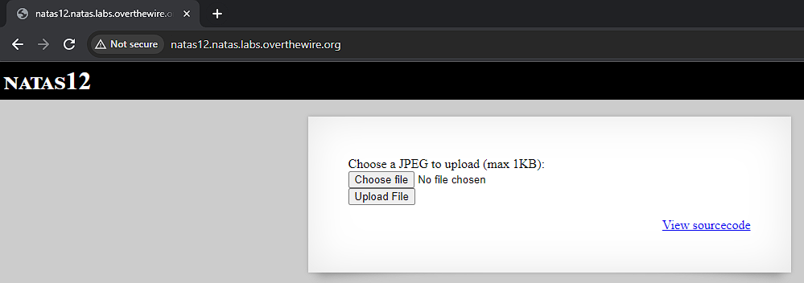
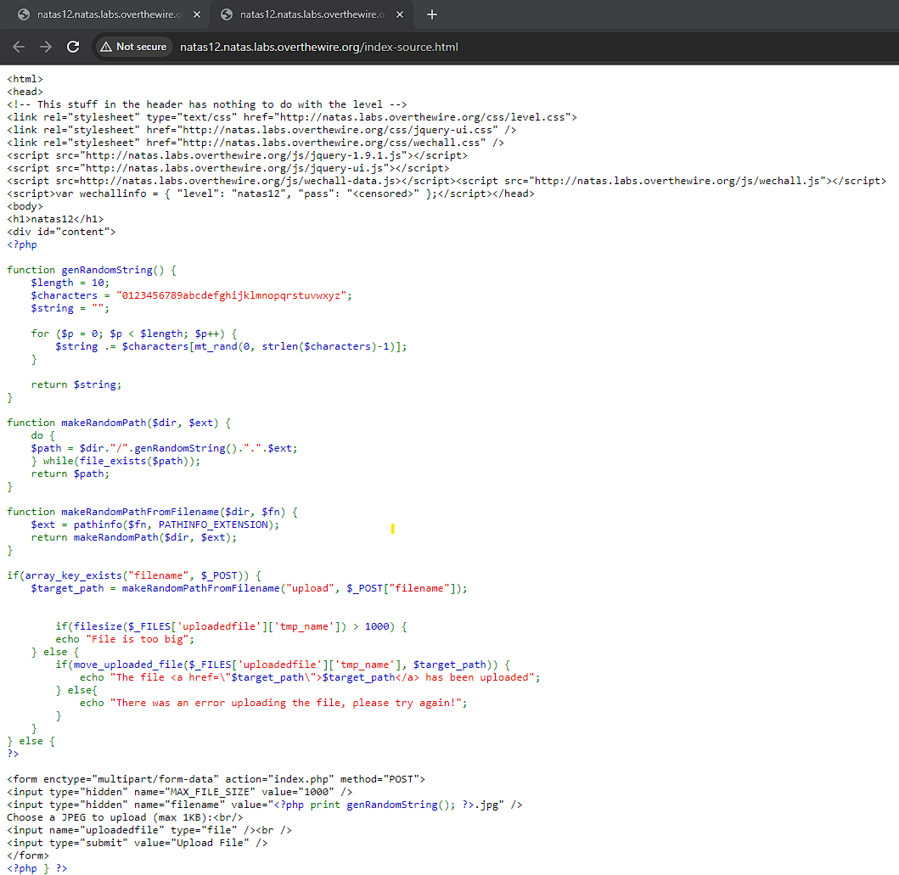
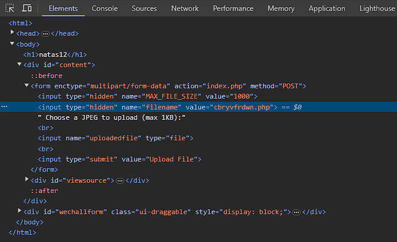
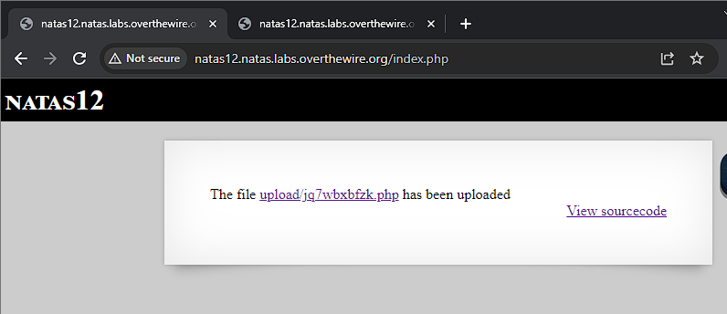
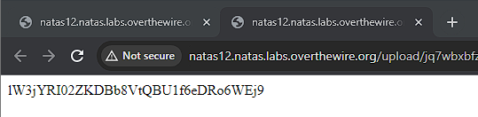

# Natas 12

Link: http://natas12.natas.labs.overthewire.org/

We see a form where we can submit a jpg file of up to 1KB.

Viewing the source code, we see that it saves the file and changes it to a random name while giving it a .jpg extension. However there are no further checks on the file afterwards. It is likely then, that it could be weak to file upload vulnerabilities.

[File upload vulnerabilities](https://owasp.org/www-community/vulnerabilities/Unrestricted_File_Upload) are when a website allows files to be uploaded without sufficient checks. Things that are validated include their name, type, contents, or size. Improper restrictions gives attackers the opportunity to upload potentially dangerous files that could run server-side scripts. In our case the web site fails to properly check the file extension.

Thus let's first create a php file, natas12.php, with code that attempts to access /etc/natas_webpass/natas13, which we know from previous exercises contains the password.

We select the file to be uploaded the page, however before uploading, we inspect element and change the filename input as below.

By changing it to a php file, we trick the browser into accepting our php file and running it accordingly.

Success, the file has been uploaded. Now we just navigate to the link where we should see our password.

Password: lW3jYRI02ZKDBb8VtQBU1f6eDRo6WEj9