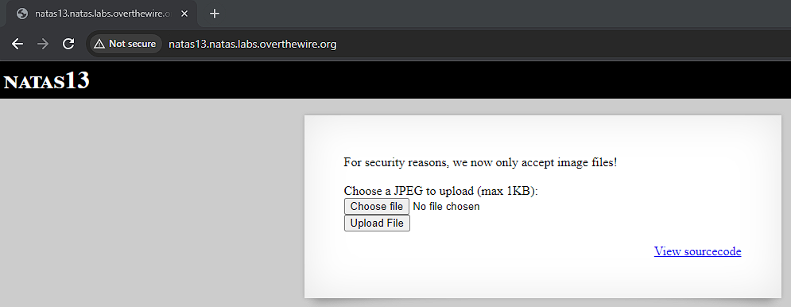
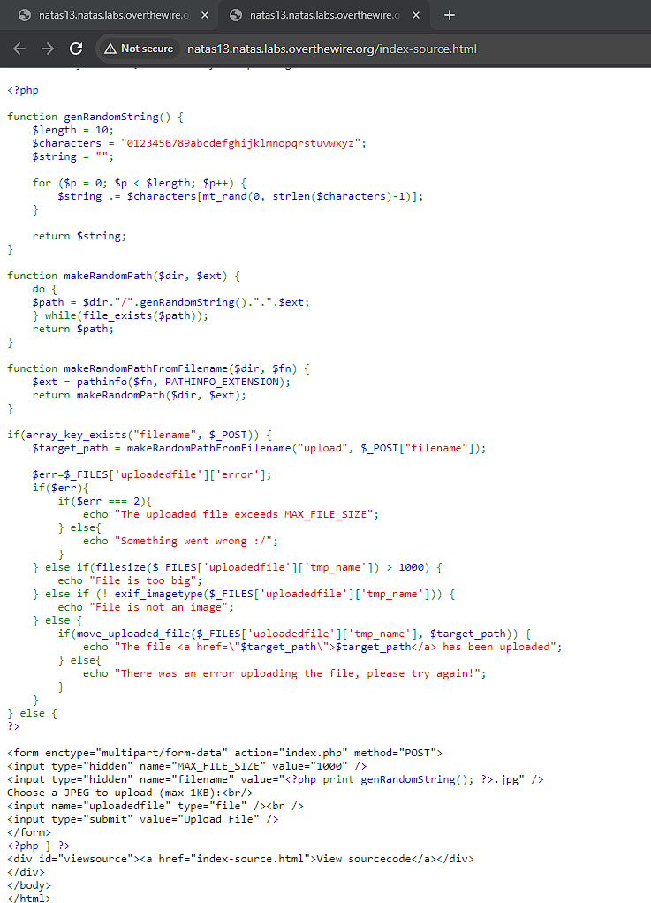
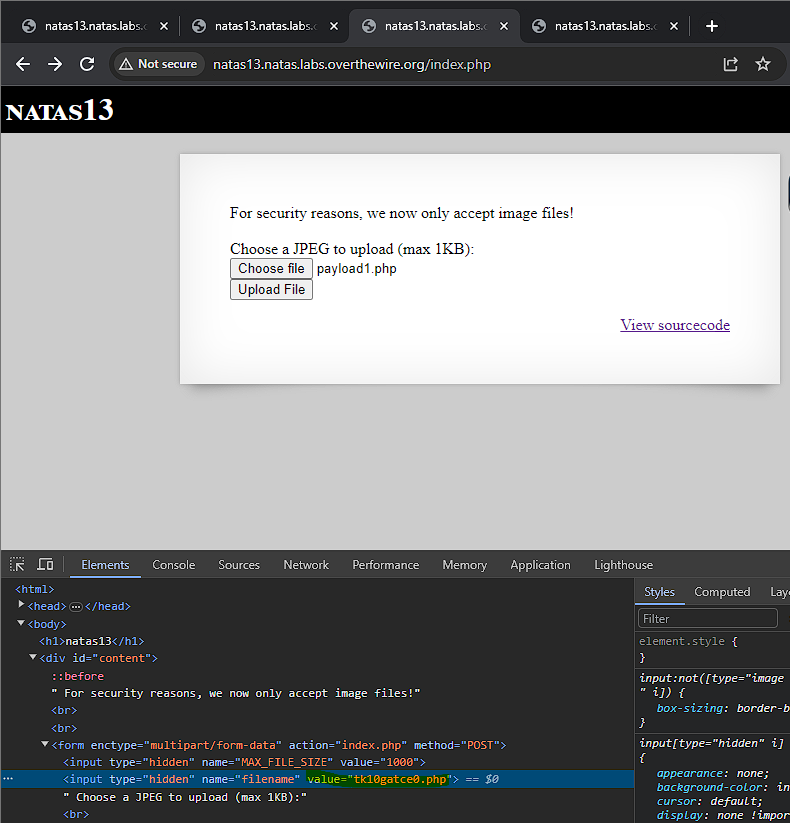
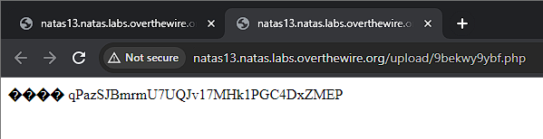
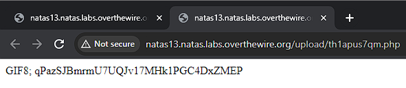

# Natas 13

Similar to natas12 we see a form where we can submit a jpg file of up to 1KB. However this time it claims that there are additional checks on whether or not they are image files. Let's view the source code to see these checks.

We can see that an additional `exif_imagetype()` check is performed on the uploaded file. Upon reading the [documentation](https://www.php.net/manual/en/function.exif-imagetype.php), we see that `exif_imagetype()` only reads the first bytes of an image and checks its signature.

The first bytes that it is referring to are the [file magic numbers](https://gist.github.com/leommoore/f9e57ba2aa4bf197ebc5), which are the first bits of a file,which are used to uniquely identify the type of file. This can easily be spoofed to trick the function into thinking that the php file we upload is a jpg file.

Similar to natas12 we need to create a php file with code that attempts to access /etc/natas_webpass/natas14. However this time we need to prepend the magic numbers to the file. To do this properly we need to use shell commands. From research we find that the magic numbers for jpg are `0xFF 0xD8 0xFF 0xE0`. The shell commands to run are as below.

    $ echo -e "\xFF\xD8\xFF\xE0" > payload1.php
    $ echo -n '<?php echo passthru("cat /etc/natas_webpass/natas14");?>' >> payload1.php
    $ file payload1.php 
        payload1.php: JPEG image data

The first line appends the file signature to `payload1.php` and the second line appends the php code afterwards.

We select the file to be uploaded the page, however before uploading, we inspect element and change the filename input as below.

Similarly to natas12, this is necessary to trick the browser into accepting our php file and running it. Similarly to natas12 we click on the link to get the password.

Note that since the code only checks if `exif_imagetype()` is valid or not, we can also give it other magic numbers. For example, `payload2.php` was given a the signature of a gif and was accepted. Changing the file to a gif via signature can be done in the text editor directly and doesn't need to be done via command line.

Password: qPazSJBmrmU7UQJv17MHk1PGC4DxZMEP