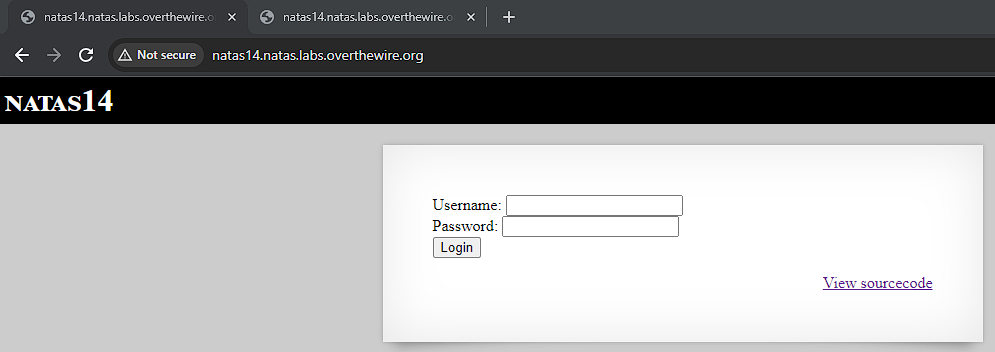
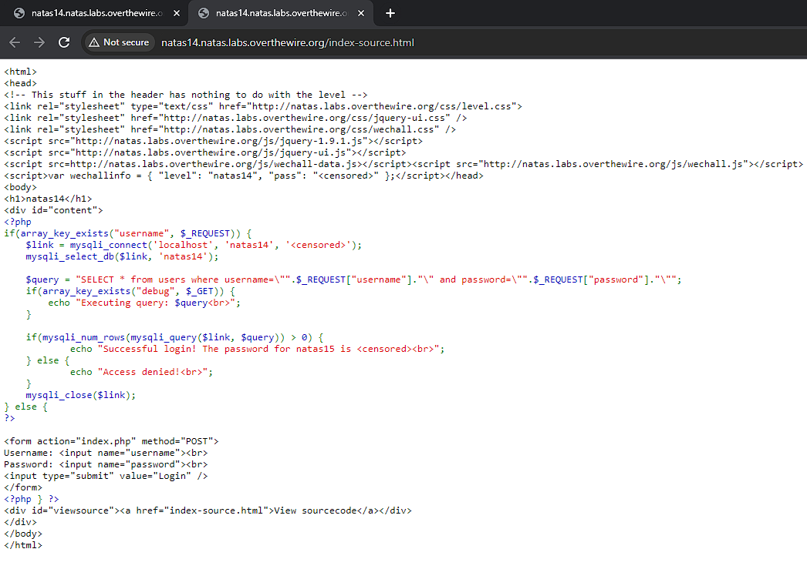
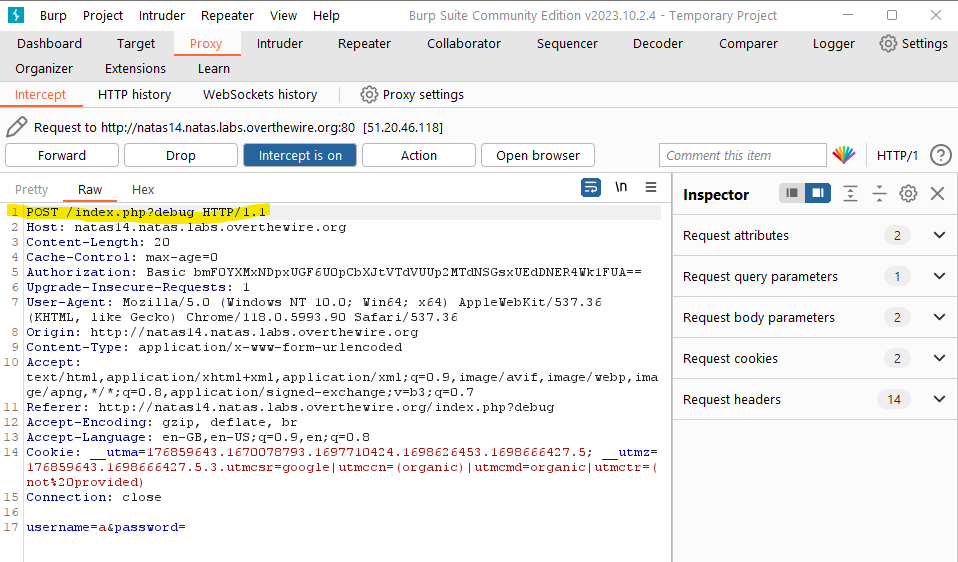
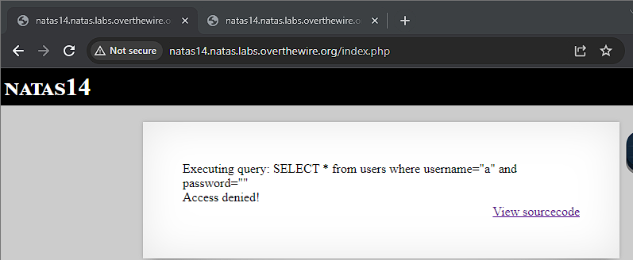
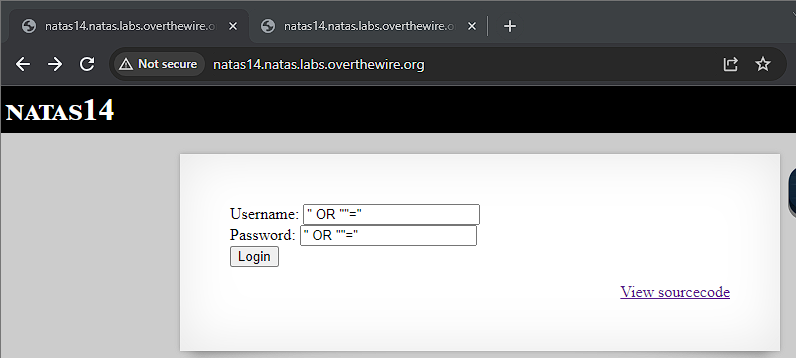
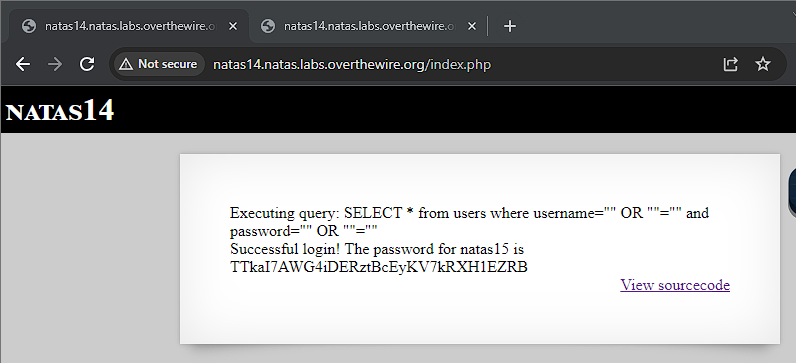

# Natas 14

After viewing and playing around with the page, we see what appears to be a standard login page. Let's see the source code.

We see that it is accessing a mySQL database, specifically a `users` table which has columns `username` and `password`. If we obtain the correct login details we we be able to gain access to the password. 

The code also provides us with a handy debugger. If we pass the parameter debug, we can see the query being executed.

To do so, we use our BurpSuite once again. Notice how we add the debug parameter after /index.php.

Forwarding the request we can see the query being executed and "Access denied!" message.

We can see that there are no quotation sanitation being performed on the query. This opens the possibility of a [SQL injection](https://portswigger.net/web-security/sql-injection).

A SQL injection is an attack where a hacker can interfere with the queries run by a web site thus possibly gaining access of user's data or even deleting data as well.

An attack can occur if queries are created using simple string concatenation such as in that of the source code. Instead queries should be [parameterized](https://portswigger.net/web-security/sql-injection#how-to-prevent-sql-injection).

Let's attempt a SQL injection attack. Here we can perform a SQL Injection based on ""="" is always true. By using something that is always true on a conditional, we can add an OR to ensure that we always pass checks. Thus let's use `" OR ""=""` as the username and password

Again we intercept the request to view it in debug mode. Forwarding this request we get the result below.

This clearly shows the query that we tricked the website to run as well as the password for the next stage.

Password: TTkaI7AWG4iDERztBcEyKV7kRXH1EZRB